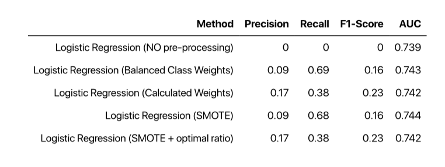

 # Spotify Top Songs Prediction 
In this project me and my team looked at possibility of predicting a top 100 songs on Spotify based on prevous charts. 

Questions asked: 

- what do all these hit songs have in common?
- is there a certain pattern in determining if a song can be a hit?
- what are the significant and influencial predictors? 

In this project we will _classify_ a song is a hit or non-hit based on its audio features: 

**Features** | **Description**
------------ | -------------
acousticness  | A confidence measure from 0.0 to 1.0 of whether the track is acoustic. 1.0 represents high confidence the track is acoustic. 
dancebility | How suitable a track is for dancing based on a combination of musical elements including tempo, rhythm stability, beat strenght and overall regularity. 0.O is least danceable 1 most danceable.
duration_ms | Duration of the track in milliseconds
energy | Measure of intensity and activity. 0.0 being least and 1.0 being most energetic
instrumentalness | Predictict whether a track contains no vocals. Closer to 1.0 indicates that track contains no vocal. 
liveness | Predicts whether a track was performed live based on audience in the back. 
loudness | Tracking loudness in decibels (dB). Values typically range between -60 and 0.
speechiness | Presence of spoken words in a track. The closer to 1.0 the more words the track contains.
tempo | The overall estimated tempo in beats per minute (BPM).
valence | Scores the overall positiveness conveyed by a track. 
artist_popularity | The popularity of an artist. 


## Create features and variables.

Pythonb was used to pull data from Spotify's ApI and utilied packed called Spotipy https://github.com/plamere/spotipy. 

Libraries: 

```
import urllib
import spotipy
import json
import pandas as pd
from spotipy.oauth2 import SpotifyClientCredentials 

```

Then we engeered 3 files: 

* _pandas dataframe of songs of given year_
* _pandas dataframe of songs featuers of given songs_
* _updated pandas dataframe of song features with a new hit value:
        0 - not in the given top playlist
        1 - in the given top playlist_ 


## Dataset 

Below is a snapshot of what the data looks like after we pulled what we needed. 

```
df.head(10)

```


## SOME OF THE DATA VISUALIZATION

Correlation Plot and Distribiution: 


Insigthts of top songs: 

- are more likely to be produced by top artists 
- have more danceability
- are not live
- are not too loud
- less words

## DATA ANALYSIS 

### Models used: 

1. **Logistic Regression**
2. **Gaussian Naive Bayes**
3. **Decision Tree**
4. **Random Forests**

### Logistics Regression (No Preprocessing):

```
predictors = [
    "acousticness", "danceability", "energy", "instrumentalness", "liveness",
    "loudness", "speechiness", "tempo", "valence", "artist_popularity"
]
X = df[predictors]
y = df["hit"].astype("bool")
``` 
Split training data and validating data (70-30 split)

```
x_train, x_test, y_train, y_test = train_test_split(X, y, test_size=0.3)
logisticRegr = LogisticRegression(solver='liblinear', random_state=10)
logisticRegr.fit(x_train, y_train)
y_test_pred = logisticRegr.predict(x_test)
cnf_matrix = metrics.confusion_matrix(y_test, y_test_pred)
print(cnf_matrix)
print(metrics.classification_report(y_test, y_test_pred))
```

... 


### Different methods were used on Logistic Regression to improve results : 



The Calculated Weights Method yielded the best results. 

```
 pd.DataFrame(np.exp(logisticRegr.coef_.toarray()), columns=predictors)
 ```
 
 
 ### Gaussian Naive Bayes ( No Preprocessing ):
 
 ```
 predictors = [
    "acousticness", "danceability", "energy", "instrumentalness", "liveness",
    "loudness", "speechiness", "tempo", "valence", "artist_popularity"
]
X = scale(df[predictors])
y = df["hit"].astype("bool")
```

Split training data and validating data (70-30 split)
```
x_train, x_test, y_train, y_test = train_test_split(X, y, test_size=0.3)
gnb = GaussianNB()
gnb.fit(x_train, y_train)
y_test_pred = gnb.predict(x_test)
cnf_matrix = metrics.confusion_matrix(y_test, y_test_pred)
print(cnf_matrix)
print(metrics.classification_report(y_test, y_test_pred))
y_pred_proba = gnb.predict_proba(x_test)[::, 1]
fpr, tpr, _ = metrics.roc_curve(y_test, y_pred_proba)
auc = metrics.roc_auc_score(y_test, y_pred_proba)
plt.plot(fpr, tpr, label="data 1, auc=" + str(auc))
plt.legend(loc=4)
plt.show()
```

... 

### Different methods were used on Naive Bayes to improve results : 


Not much improvement with different models from the original. 

### Decision Trees: 

Following similar code from above..^^ 

### Different methods were used on Decision Trees to improve results 


Modeling improved the results for Decision Tree with no preprocessing. 

Zoom in here for details on DT : https://i.imgur.com/ciG996z.png 


### Random Forests(No Processing) 

```
x_train, x_test, y_train, y_test = train_test_split(X, y, test_size=0.3)
rfTree = RandomForestClassifier(n_estimators=100, random_state=20)
rfTree.fit(x_train, y_train)
y_pred = rfTree.predict(x_test)
cnf_matrix = metrics.confusion_matrix(y_test, y_pred)
print(cnf_matrix)
print(metrics.classification_report(y_test, y_pred))
y_pred_proba = rfTree.predict_proba(x_test)[::, 1]
fpr, tpr, _ = metrics.roc_curve(y_test, y_pred_proba)
auc = metrics.roc_auc_score(y_test, y_pred_proba)
plt.plot(fpr, tpr, label="data 1, auc=" + str(auc))
plt.legend(loc=4)
plt.show()
```


Similarly to Decison Trees we performed feature reduction and gini impurity scores. 


### Random Forest, Feature-reduced 


Out of the results we were able to predict 220 songs correctly, with precision score of .99, recall of .77, f1 of .86 and AUC of .94


## Business Takeaways 

It is a big advantage to a company like Spotify or Apple to be able to predict hit songs. Playlists and advertisements can be picked accordingly and carefully, paying more attention to hit songs. This can lead to billions of revenue. 
More useres can potentally be transformed to premium if the platform can satisy the taste of the music and premium users make up for about 90 % of revenue!


